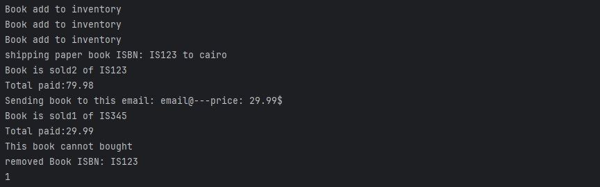

# BookStore Inventory Management System

This is a Java-based BookStore Inventory Management System designed to manage different types of books (Paper Books, E-books, and Showcase Books) in a bookstore. The system allows for adding books to inventory, removing outdated books, and purchasing books with appropriate validation and service integrations (e.g., email for e-books and shipping for paper books).

## Table of Contents
- [Project Overview](#project-overview)
- [Features](#features)
- [Class Structure](#class-structure)
- [Getting Started](#getting-started)
- [Usage](#usage)
- [Dependencies](#dependencies)
- [Contributing](#contributing)
- [License](#license)

## Project Overview
The system is built to handle bookstore operations efficiently. It supports:
- Adding books to the inventory.
- Removing outdated books based on publication year.
- Purchasing books with specific rules for each book type:
  - **Paper Books**: Physical books with stock management and shipping.
  - **E-books**: Digital books sent via email, limited to one purchase at a time.
  - **Showcase Books**: Display-only books that cannot be purchased.

The project uses object-oriented principles, including inheritance, abstraction, and interfaces for extensibility.

## Features
- **Inventory Management**: Add and remove books from the inventory.
- **Outdated Book Removal**: Automatically remove books older than a specified number of years.
- **Book Purchasing**:
  - Paper Books: Checks stock availability and triggers shipping.
  - E-books: Sends the book to the provided email.
  - Showcase Books: Non-purchasable, throws an exception if attempted.
- **Service Integration**:
  - Email service for E-books (`Mailservice` interface).
  - Shipping service for Paper Books (`ShippingServiece` interface).

## Class Structure
The project is organized into two packages: `BookStore` and `Books`.

### Package: `BookStore`
- **`inventory_Mangement.java`**: Manages the bookstore inventory using a `HashMap` to store books. Provides methods to:
  - Add books (`adBook`).
  - Remove outdated books (`removeOutDateBooks`).
  - Purchase books (`buySingleBook`).

### Package: `Books`
- **`Book.java`**: Abstract base class for all book types. Contains common attributes (`ISBN`, `title`, `yearPuplished`, `price`) and methods (`isOutDate`, `buy`).
- **`Ebook.java`**: Extends `Book` and implements `Mailservice`. Represents digital books that can be purchased one at a time and sent via email.
- **`PaperBook.java`**: Extends `Book` and implements `ShippingServiece`. Represents physical books with stock management and shipping functionality.
- **`ShowCaseBook.java`**: Extends `Book`. Represents display-only books that cannot be purchased.
- **`Mailservice.java`**: Interface for sending emails (used by `Ebook`).
- **`ShippingServiece.java`**: Interface for shipping services (used by `PaperBook`).

## Getting Started
### Prerequisites
- Java Development Kit (JDK) 8 or higher.
- An IDE (e.g., IntelliJ IDEA, Eclipse) or a text editor with Java compilation support.
- Basic knowledge of Java and object-oriented programming.

### Installation
1. Clone or download the project repository.
2. Open the project in your preferred IDE.
3. Ensure the project structure matches the provided `.iml` file (`Fawry_task2.iml`).
4. Compile and run the project.


## Usage

### 1. Add a Book to Inventory

```java
Book book = new PaperBook("123456", "Java Programming", 2020, 29.99, 100);
inventory_Mangement inventory = new inventory_Mangement();
inventory.adBook(book);
```



